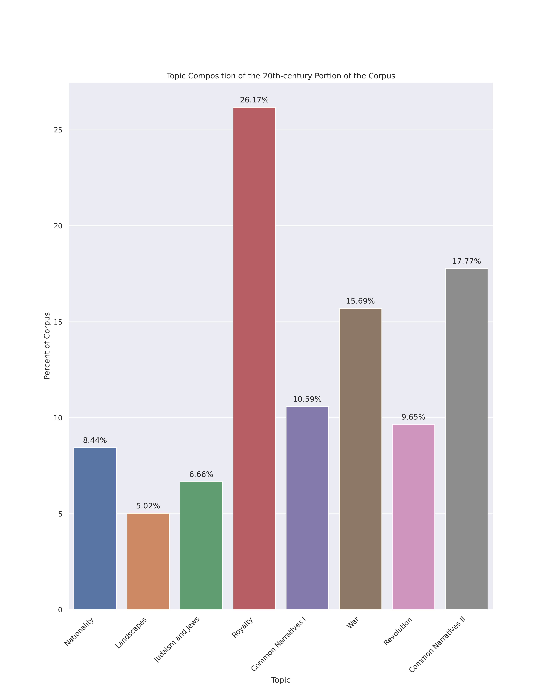

  <h3 align="center">Faces of Russia</h3>

  <p align="center">
    Analyzing a corpus of historical literature using LDA topic models
    <br />
    <a href="https://github.com/ABerry057/facesOfRussia/issues">Report Bug</a>
    ·
    <a href="https://github.com/ABerry057/facesOfRussia/issues">Request Feature</a>
  </p>
</p>


<!-- TABLE OF CONTENTS -->
## Table of Contents

* [About the Project](#about-the-project)
  * [Built With](#built-with)
* [Usage](#usage)
* [Contributing](#contributing)
* [License](#license)
* [Contact](#contact)
* [Acknowledgements](#acknowledgements)


<!-- ABOUT THE PROJECT -->
## About The Project



### Built With

* [gensim 3.8.0](https://github.com/RaRe-Technologies/gensim)
* [gutenberg 0.8.0](https://github.com/c-w/gutenberg)
* [MALLET 2.0.8](http://mallet.cs.umass.edu/topics.php)
* [matplotlib 3.3.2](https://github.com/matplotlib/matplotlib)
* [pandas 1.0.1](https://github.com/pandas-dev/pandas)
* [seaborn 0.11.0](https://github.com/mwaskom/seaborn)
* [tqdm 4.43.0](https://github.com/tqdm/tqdm)

<!-- USAGE EXAMPLES -->
## Usage

Performing the analysis is as simple as running:
```
python src/main.py
```
This will prompt you to choose a specific era to analyze and will then: create the corpus with raw text and metadata, perform topic modeling using MALLET, output the top 10 words associated with each topic, and create three kinds of visualization.

This project (and repository) is uses a corpus composed of English-language literature concerning Russia in the 1800s and early 1900s. To use a different corpus, you will need to create a list of text's ID (EBook-No.) from Project Gutenberg and replace the contents of `russia_IDs.txt` with that list. You may also wish to modify that file's name as appropriate.

To split the corpus by a date threshold, you will also need to the publication dates for the corpus through other means (Project Gutenberg does not provide this).

Before running any of the topic modeling scripts, however, make sure to have a copy of MALLET 2.0.8 located in the `src` directory. This is not included in this repository due to storage limitations.

<!-- CONTRIBUTING -->
## Contributing

Contributions are what make the open source community such an amazing place to be learn, inspire, and create. Any contributions you make are **greatly appreciated**.

1. Fork the Project
2. Create your Feature Branch (`git checkout -b feature/AmazingFeature`)
3. Commit your Changes (`git commit -m 'Add some AmazingFeature'`)
4. Push to the Branch (`git push origin feature/AmazingFeature`)
5. Open a Pull Request

<!-- LICENSE -->
## License

Distributed under the GNU General Public License v3.0 License. See `LICENSE` for more information.

<!-- CONTACT -->
## Project Contact

Project Link: [https://github.com/ABerry057/facesOfRussia](https://github.com/ABerry057/facesOfRussia)

<!-- ACKNOWLEDGEMENTS -->
## Acknowledgements

* [Othneil Drew](https://github.com/othneildrew/Best-README-Template/blob/master/BLANK_README.md) for the template used for this README.